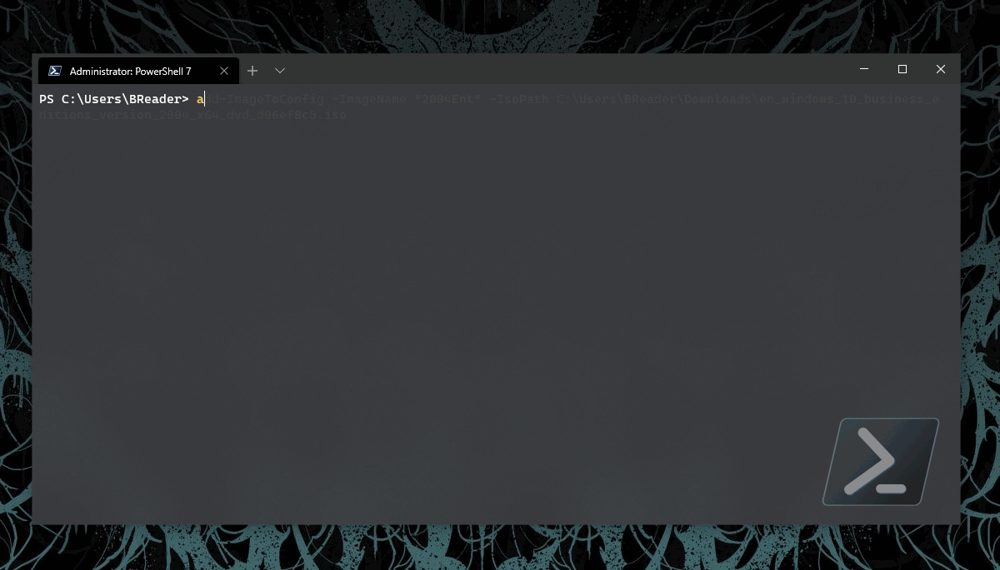

# Intune.HV.Tools
[](https://dev.azure.com/powers-hell/Intune.USB.Creator/_build/latest?definitionId=37&branchName=master)


## Summary

A set of tools to assist with the creation of Intune managed virtual machines in Hyper-V.

Created in collaboration with:

- [AdamGrossTX](https://github.com/AdamGrossTX)
- [brucesa85](https://github.com/brucesa85)
- [OnPremCloudGuy](https://github.com/onpremcloudguy)

## Pre-Reqs

- [WindowsAutoPilotIntune](https://www.powershellgallery.com/packages/WindowsAutoPilotIntune)
- [Microsoft.Graph.Intune](https://www.powershellgallery.com/packages/Microsoft.Graph.Intune/)
- [Hyper-ConvertImage](https://www.powershellgallery.com/packages/Hyper-ConvertImage/)
- [PowerShell 7](https://docs.microsoft.com/en-us/powershell/scripting/install/installing-powershell-core-on-windows?view=powershell-7)
- A copy of Windows 10 (Multi-format ISO recommended)

## How to use

### Install the module

``` PowerShell
Install-Module -Name Intune.HV.Tools -Scope CurrentUser
```

### Initialize the environment

``` PowerShell
Initialize-HVTools -Path C:\Lab
```

If the path provided doesn't exist it will be automatically created. Please note this tool creates very large reference images - if your system drive is small, dont initialize the tools on it.

The environment is a simple folder structure containing the configuration file for the tool, reference images to be used for provisioning of VMs and tenant folders containing offline Autopilot configuration files and provisioned *.vhdx images.

Folder structure example displayed below:

```
📦.hvtools
 ┣ 📂tenantVMs
 ┃ ┣ 📂MegaCorp
 ┃ ┃ ┗ 📜AutopilotConfigurationFile.json
 ┃ ┃ ┣ 📜MegaCorp_1.vhdx
 ┃ ┃ ┗ 📜MegaCorp_2.vhdx
 ┃ ┃ ┗ 📜MegaCorp_3.vhdx
 ┃ ┃ ┗ 📜MegaCorp_4.vhdx
 ┃ ┣ 📂Powers-Hell
 ┃ ┃ ┣ 📜AutopilotConfigurationFile.json
 ┃ ┃ ┣ 📜Powers-Hell_1.vhdx
 ┃ ┃ ┗ 📜Powers-Hell_2.vhdx
 ┃ ┗ 📜wks2004ref.vhdx
 ┗ 📜hvconfig.json
```

### Re-Initialize the environment

``` PowerShell
Initialize-HVTools -Path C:\Lab -Reset
```

Completely resets the configuration if you have already built out your environment. Super destructive. You've been warned.

### Add images to the environment

``` PowerShell
Add-ImageToConfig -ImageName "2004" -IsoPath "C:\Path\To\Win10-2004.iso"
```

You can add as many images to the environment as you want.

If you want to build different reference images based on different editions (Pro, Ent, Edu) make the image name unique and use the same path to the image media.

The name doesn't need to reflect the Build of win10, but it helps to keep things standardized.

``` PowerShell
Add-ImageToConfig -ImageName "2004edu" -IsoPath "C:\Path\To\Win10-2004.iso"
Add-ImageToConfig -ImageName "2004pro" -IsoPath "C:\Path\To\Win10-2004.iso"
Add-ImageToConfig -ImageName "2004ent" -IsoPath "C:\Path\To\Win10-2004.iso"
```

During this process the reference image will be created. You will be asked to select an edition to build with.

If you name your images based on editions you can have multiple images per installation media.



### Add tenants to the environment

``` PowerShell
Add-TenantToConfig -TenantName 'MegaCorp' -ImageName 2004 -AdminUpn 'intune-admin@megacorp.com'
```

You can add as many tenants to the environment as you want. The <code>ImageName</code> parameter auto-completes to the available images from your environment. 

The ImageName provides the ability to set a default reference image per tenant, however this can be overwritten during creation.

### Add virtual networking to the environment

``` PowerShell
Add-NetworkToConfig -VSwitchName 'Default Switch'
```

<code>VSwitchName</code> autocompletes to the available virtual switches already created in your Hyper-V environment. At the moment you can only have one network config in your environment.

### Get HV.Tools configuration

``` PowerShell
Get-HVToolsConfig
```

Allows you to access the environment configuration file.

### Create a virtual machine

``` PowerShell
New-ClientVM -TenantName 'Powers-Hell' -OSBuild 2004 -NumberOfVMs 10 -CPUsPerVM 2 -VMMemory 8gb
```

The example above will create 10 VMs using the reference image from the environment config named '2004' with 2 CPUs per VM and 8gb of ram.
<code>TenantName</code> autocompletes from the list of tenants in your environment.
<code>OSBuild</code> autocompletes from the list of images in your environment.

Reference images are now created in the "Add-ImageToConfig" stage, but if you've deleted the reference image or if the image can't be found, it will be created at this point. You will be asked which edition you want to use for the reference image.

Once the reference image is created, the VM will be built using it. The Autopilot configuration json will be captured at this stage. This step will prompt the user for authentication using the AD Authentication Library from within the Microsoft.Graph.Intune module.

Once this Autopilot configuration is captured locally, you will not be required to authenticate again. If you want to change the Autopilot configuration, simply delete it from the tenant folder within your HV.Tools local environment.

### Create a virtual machine without Autopilot offline injection

``` PowerShell
New-ClientVM -TenantName 'Powers-Hell' -OSBuild 2004 -NumberOfVMs 10 -CPUsPerVM 2 -VMMemory 8gb -SkipAutopilot
```

Exactly the same as the previous step. Using the parameter <code>SkipAutopilot</code> allows you to build VMs without injecting the Autopilot configuration file into the *.VHDX.

## Caveat Emptor

I'm providing this solution as a tool as an educational tool to assist the IT-Pro community with absolutely ZERO warranties or guarantees - I know it works for me, but if it doesn't for you - read the code and fix it..

If you find a problem and want to contribute - please do! I love community involvement and will be as active as my schedule allows.

## Release Notes

### 1.0.0.289

- Feature: Build ref images from Add-ImageToConfig
- New Build fixes ServerOS issues
- Adds Index from wim
- General code cleanup
- Improved VM naming code
- Updated required module versions
- Updated documentation

### 1.0.0.281

- Adding check to create HGS Guardian if not present
- Create folder if needed and dismount VHDX (@hkystar35)
- Added erroraction (@hkystar35)
- updated build script to grab release notes from git
- formatting release notes
- updated release notes (@hkystar35)
- squashing an encoding bug

### 1.0.0.205

- Small bug fixes (@hkystar35)
- fixing old variable reference
- Improving cmdlet autocomplete
- updating parameter values to be standardized
- Updating cmdlet names for better use
- updating cmdlet name for easier use..
- Fixing module dependency for pwsh7 support
- Initialize-HVTools parameter Path now required.
- updating description and release notes
- Ready for prime time.. (#3)
- added serial number to notes (@brucesa85)
- preparing for first ship
- updated required modules
- fixed multiple vm naming finally...
- added support for pwsh 5 and 7
- added ability to reset the config file
- new config function added
- removing expansion
- added support for powershell 5 and 7
- added additional argumentcompleter

### 1.0.0.203

- Initial commit
